# Azure Deployment View

Comprehensive visualization of the MFE Portal backend infrastructure deployed to Azure Container Apps with Dapr integration.

## Resource Architecture

Complete Azure infrastructure deployed per environment (test/prod):

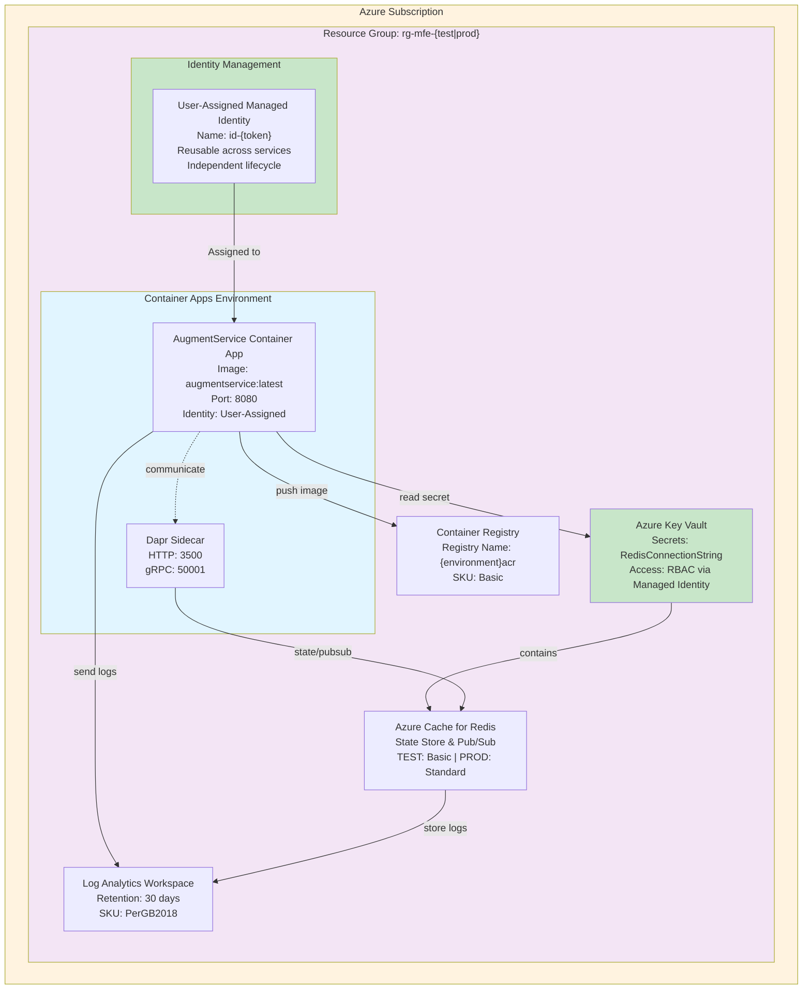

## Service Deployment Configuration

AugmentService container configuration and scaling parameters:

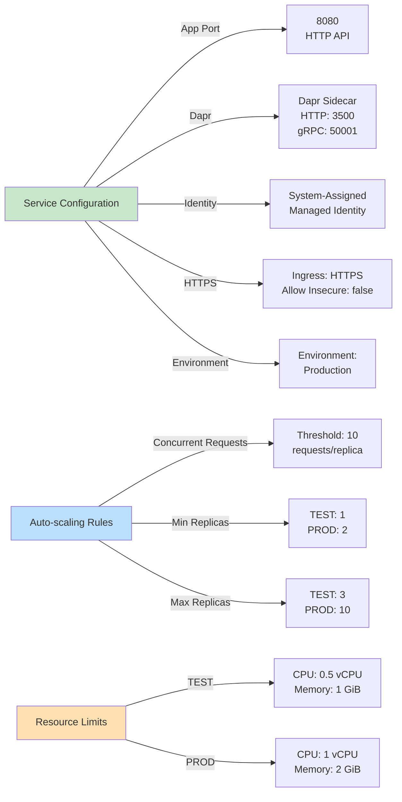

## Environment-Specific Deployment

Parameter overrides for test and production environments:

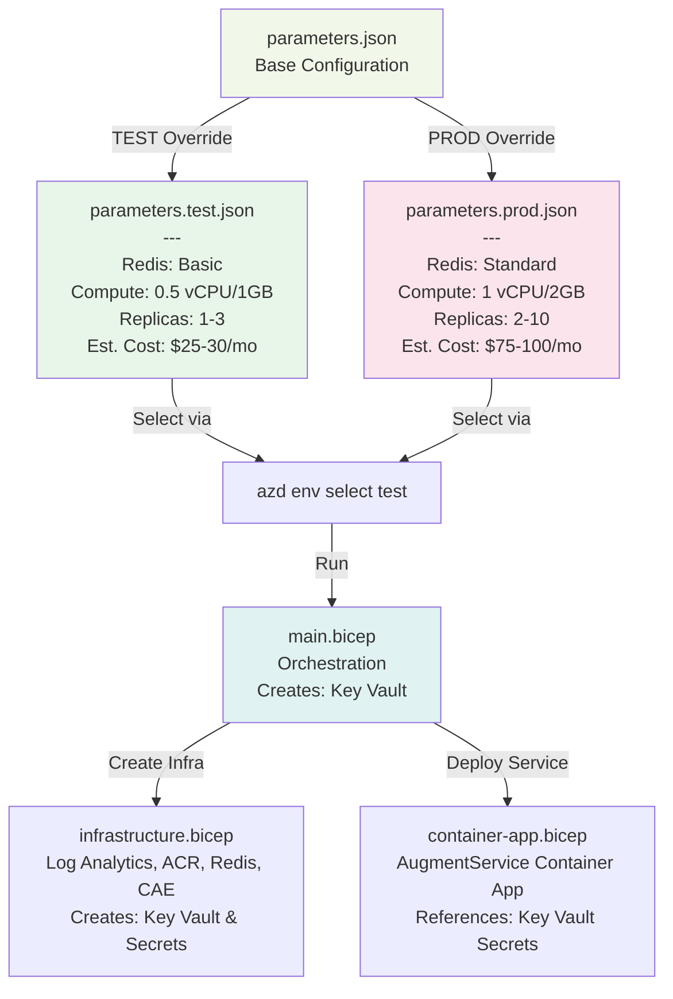

## Deployment Flow

Complete deployment pipeline from source to running container:

```mermaid
graph LR
    Dev["Local Development<br/>azd env new"]
    
    Dev -->|Configure| EnvSetup["Environment Setup<br/>azd env select {test|prod}"]
    
    EnvSetup -->|Create Resources| Provision["azd provision<br/>---<br/>Execute main.bicep<br/>Create Azure Resources"]
    
    Provision -->|Output Variables| VarOutput["AZURE_CONTAINER_REGISTRY_ENDPOINT<br/>AZURE_CONTAINER_REGISTRY_NAME<br/>RESOURCE_GROUP<br/>ENVIRONMENT_NAME"]
    
    VarOutput -->|Build & Push| Deploy["azd deploy<br/>---<br/>Build Docker Image<br/>Push to ACR<br/>Update Container App"]
    
    Deploy -->|Verify| Running["Running Service<br/>Container Apps<br/>Dapr Sidecar Active<br/>Redis Connected"]
    
    Running -->|Monitor| Monitor["azd monitor<br/>View logs & metrics<br/>Log Analytics"]
    
    style Provision fill:#c8e6c9
    style Deploy fill:#bbdefb
    style Running fill:#ffe0b2
    style Monitor fill:#f8bbd0
```

## Azure Key Vault Integration

Centralized secrets management for production deployments:

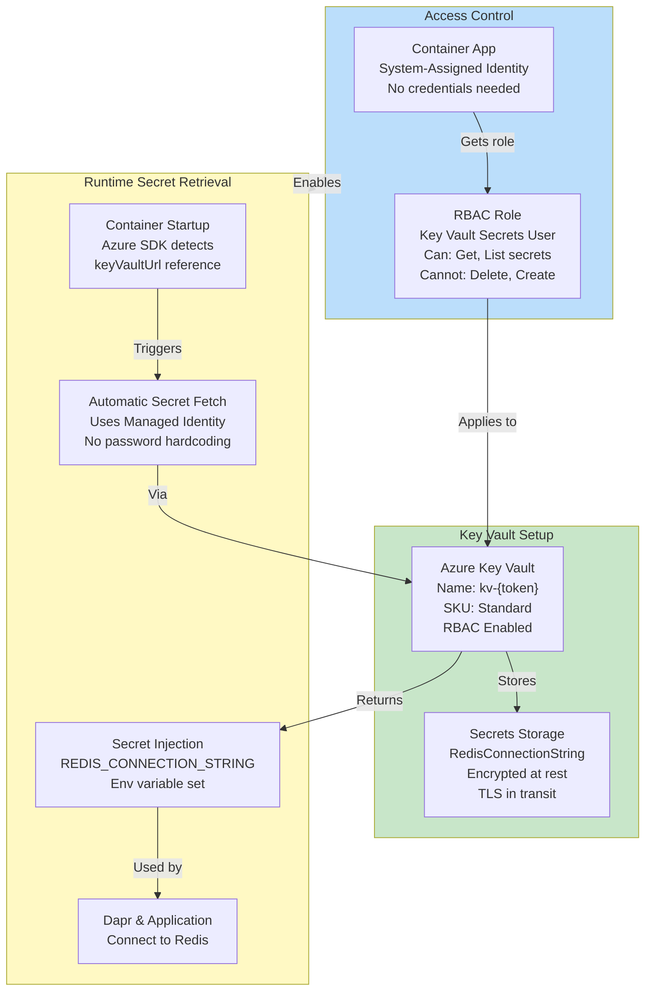

## Data Flow and Communication

How AugmentService communicates with infrastructure components:

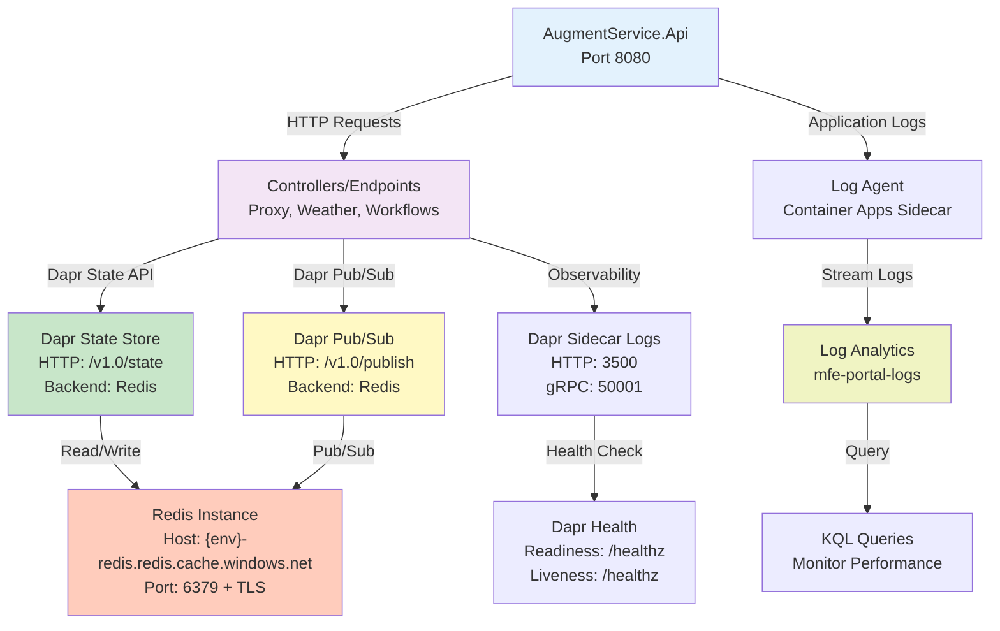

## Bicep Template Hierarchy

Infrastructure-as-Code deployment structure:

```mermaid
graph TD
    Main["main.bicep<br/>---<br/>Entry Point<br/>Parameter passthrough"]
    
    Main -->|Creates| ManagedID["User-Assigned Identity<br/>id-{token}<br/>Reusable across services"]
    
    Main -->|Calls| Infra["infrastructure.bicep<br/>---<br/>Foundational Resources"]
    Main -->|Calls| Container["container-app.bicep<br/>---<br/>Service Deployment"]
    
    Infra -->|Creates| LogA["Log Analytics Workspace<br/>workspace.json"]
    Infra -->|Creates| ACRRes["Container Registry<br/>Basic SKU<br/>Admin user enabled"]
    Infra -->|Creates| CAERes["Container Apps Environment<br/>Zone redundant: false"]
    Infra -->|Creates| RedisRes["Azure Cache for Redis<br/>TLS 1.2 minimum<br/>LRU policy"]
    Infra -->|Creates| KeyVaultRes["Azure Key Vault<br/>Standard SKU<br/>RBAC enabled"]
    
    KeyVaultRes -->|Stores| RedisSecret["Secret: RedisConnectionString<br/>Full connection string<br/>with auth"]
    
    Container -->|Receives| ManagedIDParam["Managed Identity ID<br/>Passed as parameter<br/>from main.bicep"]
    
    Container -->|Deploys| ContainerApp["Container App: augmentservice<br/>User-assigned identity<br/>HTTPS ingress enabled<br/>Dapr enabled"]
    
    Container -->|Assigns identity| IdentityAssign["Identity Assignment<br/>Attach managed identity<br/>to Container App"]
    
    Container -->|References| KeyVault["Key Vault URI<br/>Read secrets via<br/>Managed Identity"]
    
    Container -->|Configures| SecretRef["Secret References<br/>keyVaultUrl property<br/>Identity: System"]
    
    Container -->|Sets| Env["Environment Variables<br/>ASPNETCORE_ENVIRONMENT<br/>DAPR_HTTP_ENDPOINT<br/>DAPR_GRPC_ENDPOINT<br/>REDIS_CONNECTION_STRING"]
    
    Container -->|Assigns RBAC| RoleAssign["Role Assignments<br/>Identity: Key Vault Secrets User<br/>Scope: Key Vault"]
    
    Container -->|Scaling| Scale["Scaling Configuration<br/>Min: {1|2}<br/>Max: {3|10}<br/>Concurrent threshold: 10"]
    
    style Main fill:#fff9c4
    style ManagedID fill:#c8e6c9
    style Infra fill:#c8e6c9
    style Container fill:#bbdefb
    style LogA fill:#f0f4c3
    style ACRRes fill:#f0f4c3
    style CAERes fill:#f0f4c3
    style RedisRes fill:#f0f4c3
    style KeyVaultRes fill:#c8e6c9
    style RoleAssign fill:#bbdefb
    style IdentityAssign fill:#bbdefb
```

## Dapr Component Configuration

Local and production Dapr component setup:

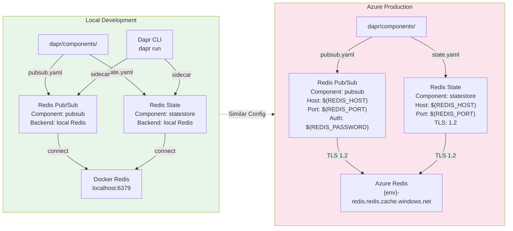

## Infrastructure Monitoring and Observability

Logging and monitoring infrastructure setup:

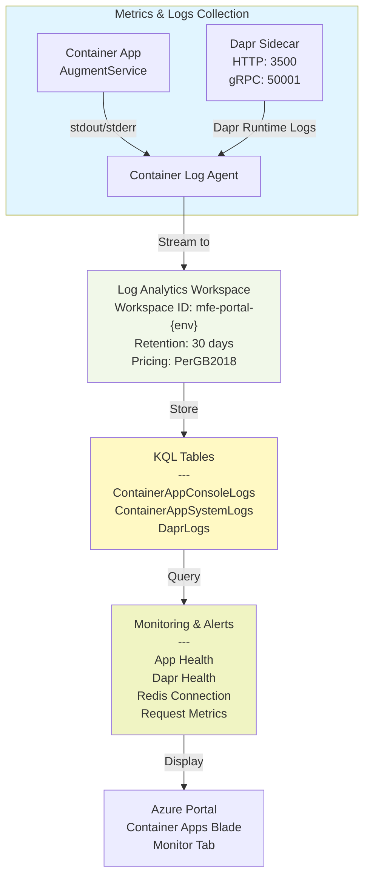

## Security and Identity Configuration

User-managed identity pattern for enterprise-scale architectures:

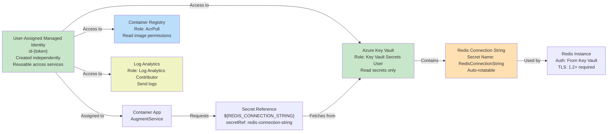

## Why User-Managed Identity

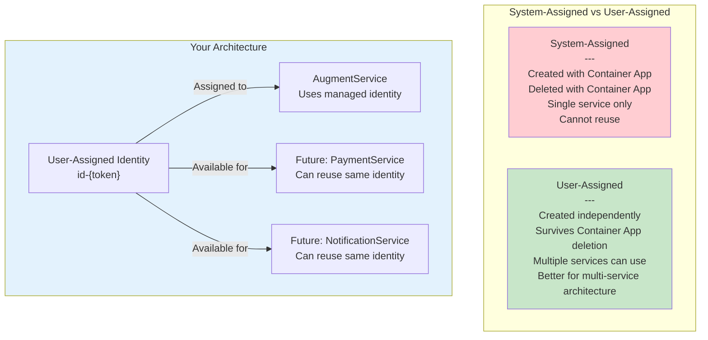

## Secrets Management Architecture

How secrets flow through Key Vault to running service:

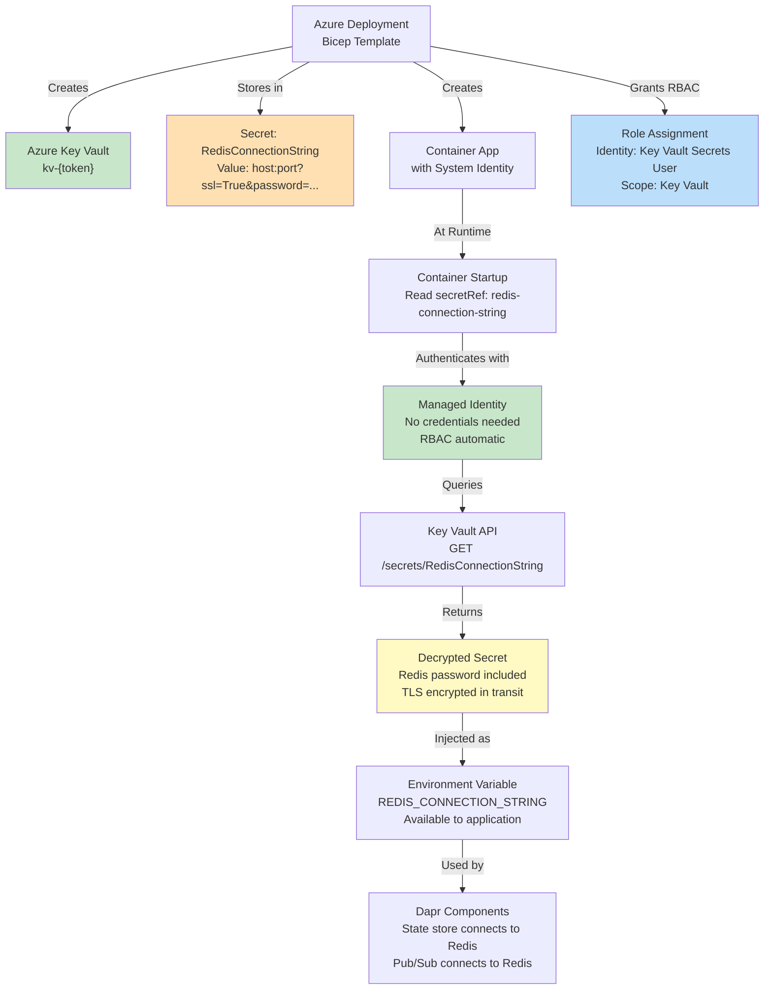

## Environment Comparison Matrix

Detailed environment-specific configurations:

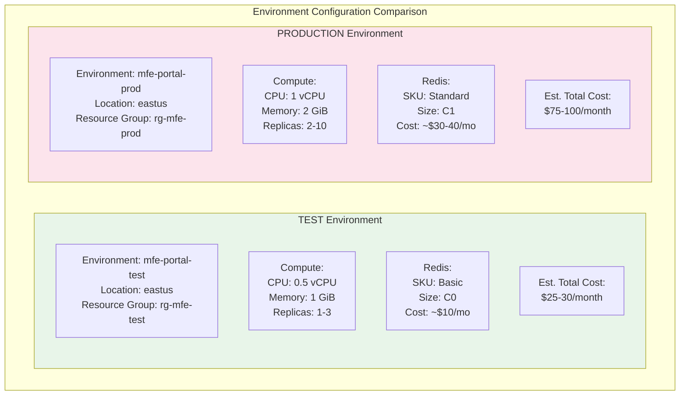

## Deployment Checklist

Pre-deployment and post-deployment verification steps:

```mermaid
graph TD
    PreDeploy["PRE-DEPLOYMENT"]
    
    PreDeploy -->|1. Verify| AzAuth["Azure Authentication<br/>azd auth login<br/>Validate subscription"]
    
    AzAuth -->|2. Select| Environment["Select Environment<br/>azd env select {test|prod}<br/>or azd env new"]
    
    Environment -->|3. Check| BicepValidate["Validate Bicep Templates<br/>Check for syntax errors<br/>Verify parameters.json"]
    
    BicepValidate -->|4. Review| Resources["Review Resources<br/>Resource names<br/>Locations<br/>Sizing"]
    
    Resources -->|Ready| Provision["PROVISION PHASE<br/>azd provision"]
    
    Provision -->|Creates| ProvisionOutput["✓ Log Analytics<br/>✓ Container Registry<br/>✓ Container Apps Env<br/>✓ Redis Instance"]
    
    ProvisionOutput -->|Next| Deploy["DEPLOY PHASE<br/>azd deploy"]
    
    Deploy -->|Executes| DeployOutput["✓ Build Docker Image<br/>✓ Push to ACR<br/>✓ Update Container App<br/>✓ Deploy Revision"]
    
    DeployOutput -->|Verify| PostDeploy["POST-DEPLOYMENT"]
    
    PostDeploy -->|1. Health Check| HealthCheck["Container App Health<br/>Status: Running<br/>Replicas: Ready"]
    
    HealthCheck -->|2. Endpoint Test| EndpointTest["Test Endpoints<br/>GET /api/product<br/>GET /proxy?url=..."]
    
    EndpointTest -->|3. Dapr Verify| DaprCheck["Verify Dapr<br/>HTTP: 3500 responding<br/>gRPC: 50001 responsive"]
    
    DaprCheck -->|4. Monitoring| Monitoring["Setup Monitoring<br/>azd monitor --from 30m<br/>Verify logs flowing"]
    
    Monitoring -->|Complete| Success["✓ DEPLOYMENT SUCCESSFUL<br/>Service ready for traffic"]
    
    style PreDeploy fill:#fff9c4
    style Provision fill:#c8e6c9
    style Deploy fill:#bbdefb
    style PostDeploy fill:#fff9c4
    style Success fill:#c8e6c9
```

## Related Documentation

- [DEPLOYMENT.md](DEPLOYMENT.md) - Step-by-step deployment guide
- [ARCHITECTURE.md](ARCHITECTURE.md) - Clean architecture overview
- [DAPR_SETUP.md](DAPR_SETUP.md) - Dapr local development and production setup
- [../azure.yaml](../azure.yaml) - Azure Developer CLI configuration

## Quick Reference Commands

```bash
# Environment management
azd auth login                    # Authenticate with Azure
azd env new <name>              # Create new environment
azd env select <name>           # Switch environment
azd env list                    # List all environments

# Deployment
azd provision                   # Create/update Azure resources
azd deploy                      # Build and deploy container image

# Monitoring & Cleanup
azd monitor --from 30m         # View logs from last 30 minutes
azd down                       # Delete all Azure resources
```
